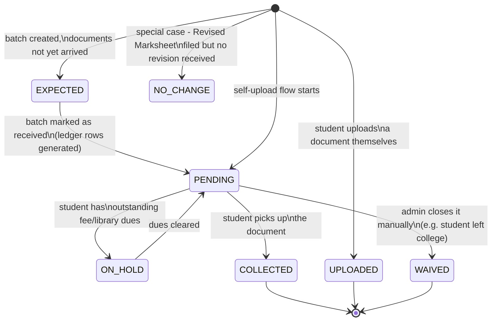
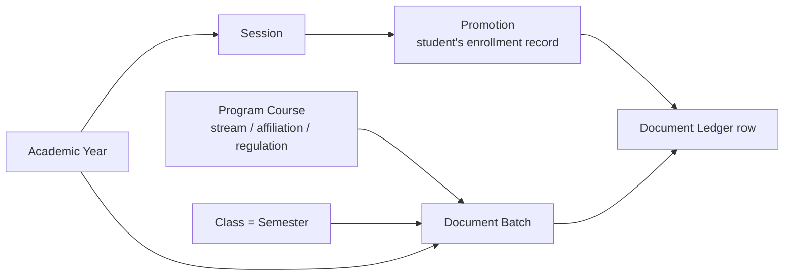

# Documents Module — Complete Reference & ER Diagram

> Purpose: understand every document-related table, how they connect, what the statuses mean, and what a **Document Dashboard** could show. Written for someone who wants to understand the whole picture in one read — no prior context needed.

---

## 1. The Big Idea, In Plain Words

Think of every student as having a **passbook** of documents — things like an Admit Card, an ID Card, an Aadhaar Card, or a marksheet. Each entry in that passbook is either:

- **Something the college gives the student** (Admit Card, ID Card) → issued in bulk as a **batch**, then handed out ("collected") one by one.
- **Something the student gives the college** (Aadhaar Card, EWS Certificate) → uploaded by the student directly.
- **Something the system generates automatically** (CU Registration PDF) → created by the system itself, no manual step.

The "passbook" table is called the **Document Ledger**. Everything else in this module exists to fill it, update it, or read from it.

---

## 2. Entity Relationship Diagram

```mermaid
erDiagram
    DOCUMENT_TYPES ||--o{ DOCUMENT_LEDGER : "defines"
    DOCUMENT_TYPES ||--o{ DOCUMENT_BATCH_RECEIPTS : "issued via"
    DOCUMENT_TYPES ||--o{ CU_REGISTRATION_DOCUMENT_UPLOADS : "categorizes"

    DOCUMENT_BATCH_RECEIPTS ||--o{ DOCUMENT_LEDGER : "generates rows in"
    DOCUMENT_BATCH_RECEIPTS ||--o{ DOCUMENT_BATCH_RECEIPT_MODES : "has 2 modes"
    DOCUMENT_BATCH_RECEIPTS ||--o{ DOCUMENT_BATCH_RECEIPT_PROGRAM_COURSES : "scoped to"
    DOCUMENT_BATCH_RECEIPTS }o--|| ACADEMIC_YEARS : "belongs to"
    DOCUMENT_BATCH_RECEIPTS }o--|| CLASSES : "for semester"
    DOCUMENT_BATCH_RECEIPTS }o--o| PROMOTION_STATUS : "optional appear-type"

    DOCUMENT_BATCH_RECEIPT_PROGRAM_COURSES }o--|| PROGRAM_COURSES : "audience"

    DOCUMENT_LEDGER }o--|| PROMOTIONS : "belongs to (per enrollment)"
    DOCUMENT_LEDGER ||--o| CU_REGISTRATION_DOCUMENT_UPLOADS : "linked upload"
    DOCUMENT_LEDGER }o--o| USERS : "providedBy / overrideBy"

    PROMOTIONS }o--|| USERS : "student"
    PROMOTIONS }o--|| SESSIONS : "enrollment period"
    SESSIONS }o--|| ACADEMIC_YEARS : "part of"

    CU_REGISTRATION_DOCUMENT_UPLOADS }o--|| USERS : "uploaded by"

    DOCUMENT_TYPES {
        int id PK
        varchar code UK "immutable server key"
        varchar name UK
        enum domain "ADMISSION, EXAM, FEES..."
        enum category "EXAM_LINKED, ADMINISTRATIVE, UPLOAD, SYSTEM_GENERATED"
        enum issuingAuthority "UNIVERSITY, COLLEGE"
        enum eligibilityRule "nullable, only for EXAM_LINKED"
        bool requiresFeeClearance
        bool requiresLibraryClearance
        bool isRecurring
        bool isActive
        int sequence
    }

    DOCUMENT_BATCH_RECEIPTS {
        int id PK
        int documentTypeId FK
        varchar name
        int academicYearId FK
        int classId FK "semester"
        int appearTypeId FK "nullable"
        timestamp expectedArrivalDate
        timestamp availableFromDate
        int documentsReceivedBy FK "nullable"
        timestamp documentsReceivedAt
        bool isArchived
    }

    DOCUMENT_BATCH_RECEIPT_MODES {
        int id PK
        int documentBatchReceiptModeId FK
        enum mode "EXAM_LINKED or ADMINISTRATIVE"
        bool isEnabled
        bool notifyStudent
    }

    DOCUMENT_BATCH_RECEIPT_PROGRAM_COURSES {
        int id PK
        int documentBatchReceiptId FK
        int programCourseId FK
    }

    DOCUMENT_LEDGER {
        int id PK
        int documentTypeId FK
        int documentBatchReceiptId FK "nullable - null for self-uploads"
        int promotionId FK
        bool isSelfSourced
        enum status "PENDING, ON_HOLD, COLLECTED, UPLOADED, WAIVED, EXPECTED, NO_CHANGE"
        text link "file/photo URL"
        timestamp collectedAt
        int providedBy FK "nullable"
        bool isOverridden
        varchar overrideReason
        int overrideBy FK "nullable"
        timestamp overriddenAt
    }

    CU_REGISTRATION_DOCUMENT_UPLOADS {
        int id PK
        int cuRegistrationCorrectionRequestId FK
        int documentId FK "-> document_types"
        varchar documentUrl
        varchar fileName
        varchar fileType
        int fileSize
        varchar remarks
        int documentLedgerId FK UK "1:1 link to ledger row"
    }

    PROMOTIONS {
        int id PK
        int studentId FK
        int sessionId FK
        bool isDeprecated
    }
```

**How to read this diagram:** `DOCUMENT_TYPES` is the catalog (what documents exist). `DOCUMENT_BATCH_RECEIPTS` is "we're issuing Admit Cards to Semester 3 B.Sc students this year." `DOCUMENT_LEDGER` is the actual passbook row: "this specific student has this specific document, in this status." Everything ties back to `PROMOTIONS`, which is a student's enrollment record for one session — **not** the student table directly, because a student can have multiple promotions across years.

---

## 3. Table-by-Table, In Plain Words

### `document_types` — the catalog

Every kind of document the college deals with is one row here: ID Card, Admit Card, Aadhaar Card, EWS Certificate, CU Registration PDF, etc.

Key fields explained:

- **`domain`** — which part of the student journey this belongs to: `ADMISSION`, `ENROLMENT`, `PRE_CU_REGISTRATION`, `POST_CU_REGISTRATION`, `EXAM`, `FEES`, `LIBRARY`, `OTHER`.
- **`category`** — how the document comes into existence:
  - `EXAM_LINKED` — tied to exam form-fillup/appearing (e.g. Admit Card)
  - `ADMINISTRATIVE` — general college-issued document (e.g. ID Card)
  - `UPLOAD` — student uploads it themselves (e.g. Aadhaar Card)
  - `SYSTEM_GENERATED` — the system creates it automatically (e.g. CU Registration PDF)
- **`requiresFeeClearance`** / **`requiresLibraryClearance`** — if true, the document is _withheld_ until the student clears dues. This is what drives the `ON_HOLD` status (explained below).
- **`code`** — a permanent internal identifier, auto-derived from the name and never changed afterward, e.g. `EXAM_ADMIT_CARD`, `ID_CARD`, `CU_REGISTRATION_PDF`.

### `document_batch_receipts` — a "batch"

A batch answers the question: **"Which document, for which group of students, this year?"**

Example: "Admit Cards, Academic Year 2025-26, Semester 3, for B.Sc Physics + B.Sc Chemistry program courses."

- `academicYearId` + `classId` (semester) + linked program courses = defines **who** the batch applies to.
- `expectedArrivalDate` / `availableFromDate` = when the physical documents are expected from the university / when they can start being handed out.
- `documentsReceivedBy` / `documentsReceivedAt` = who confirmed the college physically has the documents in hand.
- `isArchived` = hides the batch from students' view without deleting history.

### `document_batch_receipt_modes` — two switches per batch

Every batch has exactly two mode rows, each an on/off switch:

| Mode             | Meaning when turned ON                                                                                                             |
| ---------------- | ---------------------------------------------------------------------------------------------------------------------------------- |
| `EXAM_LINKED`    | "The university has handed this batch over to us" — tracks arrival. Enabled by default.                                            |
| `ADMINISTRATIVE` | "This batch is ready to hand out to students" — enabling this is meant to trigger creating the passbook rows. Disabled by default. |

Once any document in the batch has actually been collected or uploaded, **both switches lock** — you can't flip modes on a batch that's already in progress.

### `document_batch_receipt_program_courses` — the audience

A simple join table listing which program courses (e.g. "B.Sc Physics Honours") a batch applies to. A batch can target multiple program courses at once.

### `document_ledger` — the passbook (the heart of the system)

One row = one document instance held (or owed, or uploaded) by one student, for one enrollment period (`promotionId`).

Important design point: it's **not** unique per (student, document type) — a student can have several rows for the same type over time (e.g. a lost ID card gets reissued, creating a second row).

- `documentBatchReceiptId` — which batch this came from. **Null** if it's a self-upload or something outside the batch flow (like an ID card issued individually).
- `isSelfSourced` — true if the student supplied it (upload), false if the college issued it.
- `status` — see the status table below.
- `collectedAt` / `providedBy` — when and by whom the document was physically handed over.
- `isOverridden` / `overrideReason` / `overrideBy` / `overriddenAt` — an audit trail for when staff manually force a status change outside the normal flow (with a mandatory reason).

### `cu_registration_document_uploads` — CU registration specific

When a student needs to correct something on their Calcutta University registration, they upload supporting documents here. Each upload links 1:1 to a `document_ledger` row, so it still shows up in the student's passbook.

---

## 4. Status Lifecycle (`document_ledger_status`)



| Status      | Plain meaning                                                                                                                                                                                   |
| ----------- | ----------------------------------------------------------------------------------------------------------------------------------------------------------------------------------------------- |
| `EXPECTED`  | Batch exists but the physical documents haven't arrived at the college yet.                                                                                                                     |
| `PENDING`   | Document is physically available at the counter, waiting for the student to collect it. Never auto-expires.                                                                                     |
| `ON_HOLD`   | **Derived automatically** — same as PENDING, but blocked because the student owes fees or library dues (only for document types with `requiresFeeClearance`/`requiresLibraryClearance` = true). |
| `COLLECTED` | Student has picked it up. Has a timestamp and who handed it over.                                                                                                                               |
| `UPLOADED`  | Student supplied the document themselves (self-sourced).                                                                                                                                        |
| `WAIVED`    | Staff manually closed this requirement — always requires a written reason.                                                                                                                      |
| `NO_CHANGE` | Special-case display status, currently only used for Revised Marksheet cases where a correction request was filed but no revision was actually issued.                                          |

**Important:** `ON_HOLD` isn't set directly — it's computed reactively whenever a student's fee balance or a document type's clearance flag changes (see `fee-clearance.service.ts`, the file currently open in your editor).

---

## 5. Who Scopes What (No "Campus" Table)

There's no single "campus" or "branch" concept for documents. Instead, scoping flows through the academic structure:



- A **Promotion** is a student's enrollment for one session — this is what a ledger row actually attaches to (`promotionId`), not the student record directly. This matters because a student can have multiple promotions across different years.
- A **Batch** resolves to a concrete list of promotions by matching: session (derived from academic year) + class (semester) + program course(s), filtered to non-deprecated promotions of active students.
- **Program Course** is the closest thing to "which course/stream" — carries affiliation, regulation type, course, and course level.

---

## 6. Existing APIs (What Already Works Today)

| Endpoint                                                      | What it does                                                           |
| ------------------------------------------------------------- | ---------------------------------------------------------------------- |
| `GET/POST/PUT/DELETE /api/documents`                          | CRUD for the document **type** catalog                                 |
| `POST /api/documents/scan-marksheet`                          | Scans existing marksheet files by roll number                          |
| `GET /api/documents/batch-receipts`                           | List batches, with counts (total/pending/collected/recorded) per batch |
| `POST /api/documents/batch-receipts`                          | Create a new batch (pick type + year + class + program courses)        |
| `POST /api/documents/batch-receipts/promotion-count`          | Dry-run: "how many students would this batch cover?"                   |
| `PUT /api/documents/batch-receipts/:id`                       | Edit a batch (locks once ledger rows exist)                            |
| `PUT /api/documents/batch-receipts/:id/mode`                  | Toggle EXAM_LINKED / ADMINISTRATIVE switches                           |
| `POST /api/documents/batch-receipts/:id/generate`             | Create the actual PENDING ledger rows for a batch's students           |
| `GET /api/documents/batch-receipts/ledger/student/:studentId` | Full passbook view for one student                                     |
| `POST /api/documents/batch-receipts/ledger/:ledgerId/collect` | Mark a document as handed over                                         |

**There is currently no dashboard/summary endpoint.** The frontend's "Document Issuance" home page is literally an unfinished placeholder — confirming a dashboard is genuinely new work, not a duplicate of something existing.

The system also has **live updates already wired up**: every batch/ledger change is broadcast over Socket.IO (rooms: `documents`, `documents:batch:<id>`, `documents:student:<id>`), which a dashboard could subscribe to for real-time refresh instead of polling.

---

## 7. Dashboard Design Ideas

### Top-level KPI tiles

- Total documents in the ledger (all-time or filtered)
- Pending collection count
- On-hold count (fee/library blocked) — worth calling out separately since it's actionable
- Collected this week/month
- Self-uploaded count
- Expected (not yet arrived) count

### Breakdowns (good for pie/bar charts)

- **By status** — PENDING / ON_HOLD / COLLECTED / UPLOADED / WAIVED / EXPECTED
- **By document type** — which documents have the most volume (Admit Card vs ID Card vs Aadhaar, etc.)
- **By category** — EXAM_LINKED / ADMINISTRATIVE / UPLOAD / SYSTEM_GENERATED
- **By domain** — ADMISSION / EXAM / FEES / LIBRARY / etc.

### Trends (good for line/area charts)

- Documents collected per day/week over time
- New batches created over time
- Self-uploads over time

### Operational views (tables, not charts)

- Batches with the highest pending-to-collected ratio (which batches are lagging on distribution)
- Document types most frequently placed ON_HOLD (signals a fee-collection bottleneck)
- Recently created/updated batches needing attention (e.g. `EXPECTED` past their `expectedArrivalDate`)

### Filters to support

- Academic year
- Class/semester
- Program course
- Document type / category / domain
- Date range (for collected/uploaded trends)

### Suggested endpoint shape

```
GET /api/documents/dashboard/stats
  ?academicYearId=&classId=&programCourseId=&documentTypeId=&dateFrom=&dateTo=
```

Following the pattern already used in `library-dashboard.service.ts` and `fees-dashboard.service.ts`: one service function returning a typed object, computed via parallel `Promise.all` queries (scalar counts + group-by breakdowns + top-N lists), joining `document_ledger` → `document_types` → `promotions`.

---

## 8. Final Recommendation — What to Actually Show

Boiling section 7 down to a concrete, buildable set of widgets, grouped by how a staff member would actually use the page:

**A. "Is everything healthy?" — top strip**
Six KPI tiles, glanceable in one second: Total documents, Pending, On Hold, Collected (this period), Expected, Self-Uploaded. On Hold gets a warning color since it's the one that needs action.

**B. "Where's the volume?" — composition**

- Donut/pie: ledger count by **status**
- Horizontal bar: ledger count by **document type** (top 8-10, e.g. Admit Card vs ID Card vs Aadhaar)
- Stacked bar: status breakdown **per document type** (shows which types are lagging in collection specifically)

**C. "Is it moving?" — trend**

- Line/area chart: Collected vs Uploaded per day/week over the selected date range
- Optional second line: new batches created over time

**D. "What needs attention today?" — actionable tables**

- Batches table: name, type, scope, expected count, collected count, % collected, status chip — sortable by lowest % collected first
- On-Hold reasons table: document type × count of on-hold rows, so staff know which fee/library bottleneck to chase
- Overdue table: batches still `EXPECTED` past their `expectedArrivalDate`

**E. Filters** pinned at the top, affecting everything below: Academic Year, Class/Semester, Program Course, Document Type/Category/Domain, Date Range.

---

## 9. Wireframe

Low-fidelity layout — boxes represent widgets, not exact pixel sizing. Filters at top control every widget beneath them; clicking a KPI tile or chart segment cross-filters the tables at the bottom (e.g. clicking the "On Hold" tile filters the batches table to on-hold-heavy batches).

```
┌───────────────────────────────────────────────────────────────────────────────────┐
│  DOCUMENT DASHBOARD                                              🔔 live (socket)   │
├───────────────────────────────────────────────────────────────────────────────────┤
│  Filters:  [Academic Year ▾] [Class/Sem ▾] [Program Course ▾] [Doc Type ▾]          │
│            [Category ▾] [Date range: ⌈__________⌉ – ⌈__________⌉]     [Reset]       │
├───────────────────────────────────────────────────────────────────────────────────┤
│  KPI STRIP                                                                          │
│  ┌───────────┐ ┌───────────┐ ┌───────────┐ ┌───────────┐ ┌───────────┐ ┌─────────┐ │
│  │  TOTAL    │ │ PENDING   │ │ ON HOLD ⚠ │ │ COLLECTED │ │ EXPECTED  │ │ UPLOADED│ │
│  │  DOCS     │ │           │ │           │ │(this range)│ │           │ │(self)   │ │
│  │  12,480   │ │  2,140    │ │   318     │ │   6,920   │ │   540     │ │  2,562  │ │
│  └───────────┘ └───────────┘ └───────────┘ └───────────┘ └───────────┘ └─────────┘ │
├───────────────────────────────────────────┬─────────────────────────────────────────┤
│  STATUS BREAKDOWN (donut)                  │  COLLECTION TREND (line/area)          │
│                                             │                                         │
│        ┌───────────┐                       │   ▁▂▃▅▆▇█▇▆▅▃▂▁▂▃▅▆▇█   Collected      │
│       ╱  PENDING    ╲   ● Pending           │   ▁▁▂▂▃▃▄▄▅▅▆▆▇▇██▇▇   Uploaded         │
│      │  ON_HOLD      │  ● On Hold           │                                         │
│      │  COLLECTED    │  ● Collected         │   ├──┼──┼──┼──┼──┼──┼──┤               │
│       ╲  UPLOADED    ╱  ● Uploaded          │   W1 W2 W3 W4 W5 W6 W7                 │
│        └───────────┘    ● Waived/Expected   │                                         │
├─────────────────────────────────────────────┴─────────────────────────────────────────┤
│  DOCUMENT TYPE VOLUME (horizontal bar, top 10)                                        │
│                                                                                         │
│  Admit Card         ████████████████████████████████  3,240                          │
│  ID Card            ███████████████████████████ 2,610                                │
│  Aadhaar Card       ██████████████████ 1,890                                          │
│  CU Registration    ███████████████ 1,540                                             │
│  EWS Certificate    ██████ 620                                                        │
│  ...                                                                                   │
├───────────────────────────────────────────┬─────────────────────────────────────────┤
│  ON-HOLD REASONS (table)                   │  OVERDUE / NOT YET ARRIVED (table)     │
│  ┌─────────────────────────────────────┐   │  ┌───────────────────────────────────┐ │
│  │ Doc Type      │ On-Hold Count       │   │  │ Batch          │ Expected  │ Days  │ │
│  ├─────────────────────────────────────┤   │  ├───────────────────────────────────┤ │
│  │ ID Card        │ 210 (fee)          │   │  │ Admit Card S3  │ 2026-07-20│ 17 late│ │
│  │ Admit Card      │ 108 (fee)         │   │  │ ID Card S1     │ 2026-07-28│ 9 late │ │
│  │ Library Card    │  45 (library)     │   │  │ ...            │           │        │ │
│  └─────────────────────────────────────┘   │  └───────────────────────────────────┘ │
├───────────────────────────────────────────┴─────────────────────────────────────────┤
│  BATCHES NEEDING ATTENTION (table, sorted by lowest % collected)                      │
│  ┌───────────────────────────────────────────────────────────────────────────────┐  │
│  │ Batch Name            │ Type   │ Scope           │ Total │ Collected │ %  │St. │  │
│  ├───────────────────────────────────────────────────────────────────────────────┤  │
│  │ Admit Card - Sem 3    │ EXAM   │ B.Sc Phy/Chem   │ 480   │ 120       │25% │🟡  │  │
│  │ ID Card - Sem 1       │ ADMIN  │ All Sem 1       │ 620   │ 610       │98% │🟢  │  │
│  │ EWS Cert - Sem 5      │ ADMIN  │ B.A Honours     │ 90    │ 12        │13% │🔴  │  │
│  └───────────────────────────────────────────────────────────────────────────────┘  │
└───────────────────────────────────────────────────────────────────────────────────────┘
```

**Interaction notes:**

- Filters at top apply globally; changing them re-fetches every widget below.
- KPI tiles and donut segments are clickable — they cross-filter the two bottom tables (e.g. click "On Hold" → batches table re-sorts/filters to batches with the most on-hold rows).
- The 🔔 live indicator subscribes to the existing Socket.IO rooms (`documents`, `documents:batch:<id>`) so KPI numbers can tick up in real time as staff collect documents elsewhere in the app, without a manual refresh.
- Batches table row click → navigates to that batch's existing detail/ledger view (already built).

---

## 10. Glossary (Quick Reference)

| Term                    | Meaning                                                                                                           |
| ----------------------- | ----------------------------------------------------------------------------------------------------------------- |
| **Ledger**              | The passbook — one row per document instance a student is owed, holds, or uploaded                                |
| **Batch**               | A bundle: one document type issued to a scoped group of students in one academic year/semester                    |
| **Promotion**           | A student's enrollment record for one session (not the student record itself)                                     |
| **Administrative mode** | Batch switch meaning "ready to distribute to students"                                                            |
| **Exam-linked mode**    | Batch switch meaning "university has handed the batch over to us"                                                 |
| **Self-sourced**        | Document supplied by the student (upload), not issued by the college                                              |
| **ON_HOLD**             | Auto-computed status: document withheld due to unpaid fees/library dues                                           |
| **Override**            | Manual staff correction to a ledger row's status, always logged with a reason                                     |
| **CU Registration PDF** | System-generated Calcutta University registration document, one of the `SYSTEM_GENERATED` category document types |

---

_Generated from a codebase exploration of `packages/db/src/schemas/models/documents/`, `packages/db/src/schemas/enums/index.ts`, and `apps/backend/src/features/documents/`. No code was changed as part of this report._
